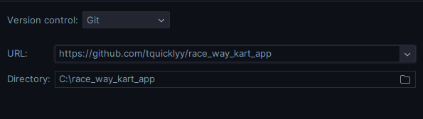
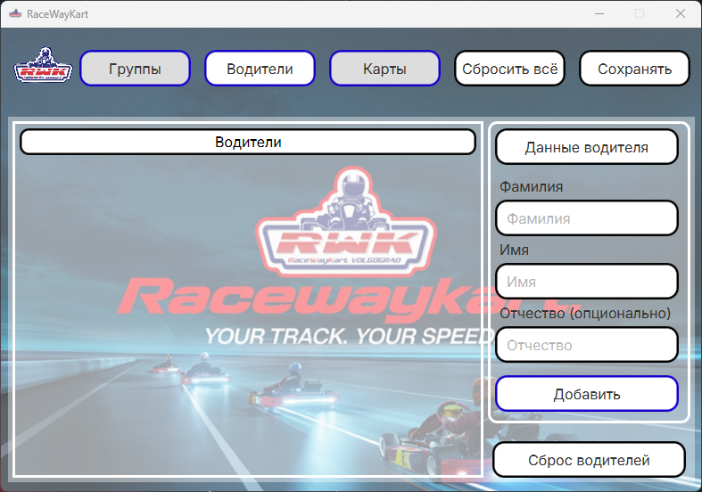
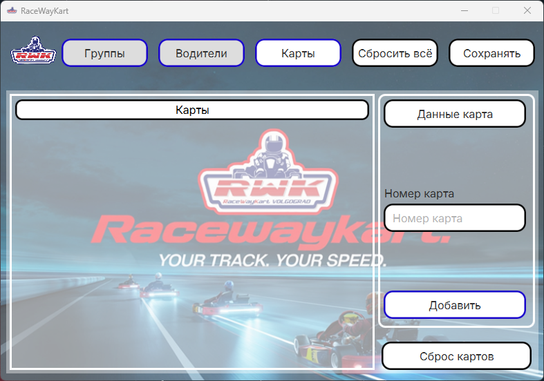
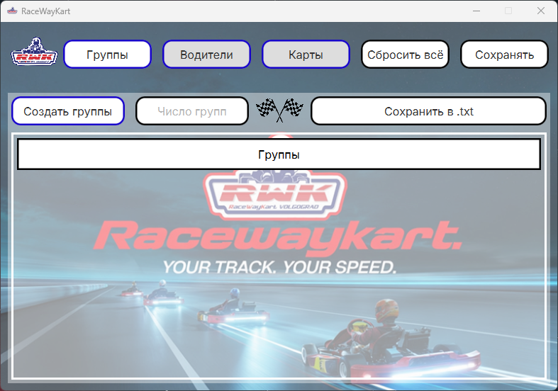
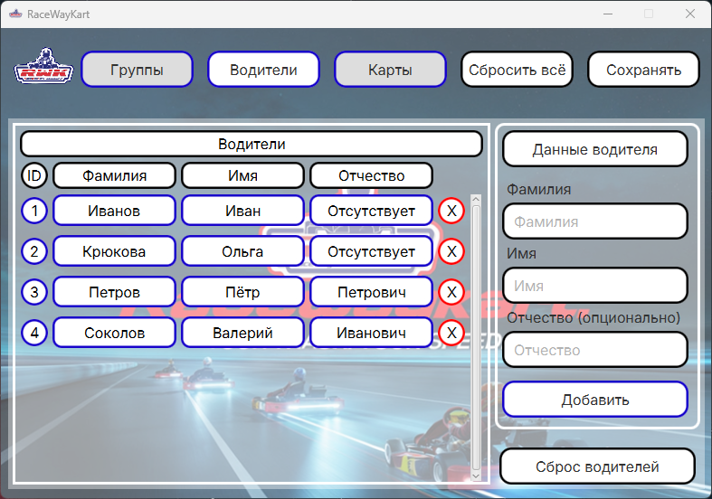
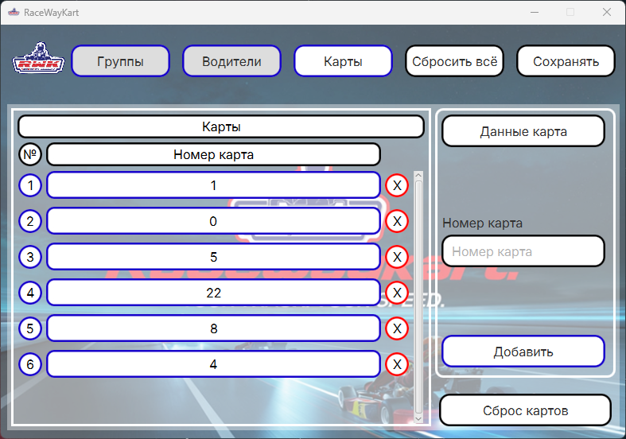
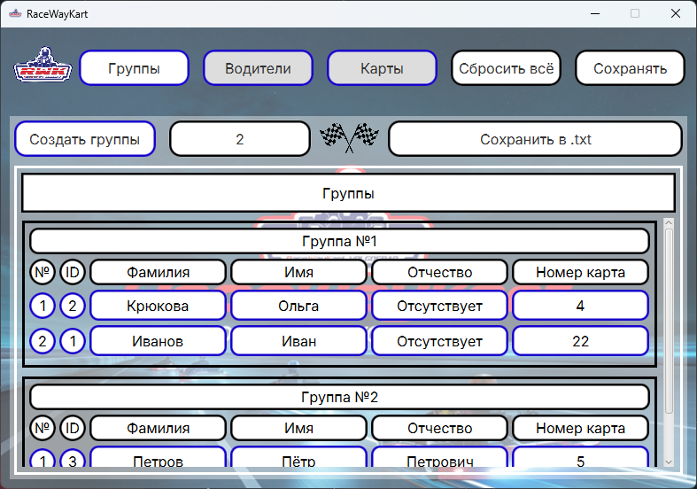

# RaceWayKart Application


Yo hey! This is an application for creating groups of racing cart races for track RaceWayKart.

# How to use it

1. Install IntelliJ IDEA if you don't have the program yet

2. Open IntelliJ IDEA: File -> New -> Project from Version Control...
<div></div>

3. Enter a link to the repository in the URL field and click Clone
```
URL: https://github.com/tquicklyy/race_way_kart_app
```
<div> </div>

4. Run and use the program.

# Info for .exe or installer

This app assumes the possibility of and executable file .exe or installer for Windows.
If you want to do this, then you cant study it by following the link from a very good person
who once helped me with this problem: [very useful videos.](https://www.youtube.com/playlist?list=PLgHQrpxH-eMjRrutskViAJz1CpU3uMiTW)

# General information

To get a list of groups (drivers + their karts), you need to:
1) Enter driver info in the drivers window;
2) Enter kart info in the karts window;
3) Enter the number of groups and start generation in the groups window.

You can also save data between launches using the button in the upper-right corner, as well as
save the list of groups to a .txt file.

# Screenshots of the app

## Windows before data entry

### Drivers window
<div></div>

### Karts window
<div></div>

### Groups window
<div></div>


## Windows after data entry

### Drivers window
<div></div>

### Karts window
<div></div>

### Groups window
<div></div>
