# RaceWayKart Application

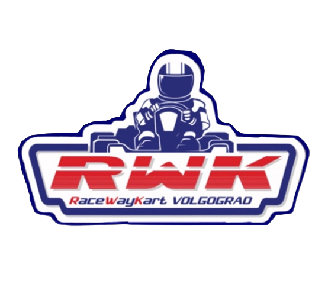

Yo hey! This is an application for creating groups of racing cart races for track RaceWayKart.

# How to use it

1. Install IntelliJ IDEA if you don't have the program yet

2. Open IntelliJ IDEA: File -> New -> Project from Version Control...
<div>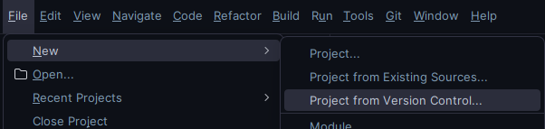</div>

3. Enter a link to the repository in the URL field and click Clone
```
URL: https://github.com/tquicklyy/race_way_kart_app
```
<div> 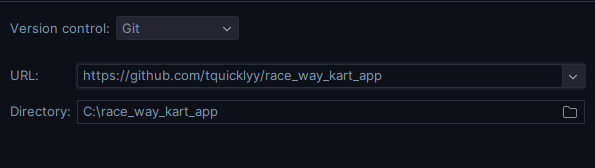</div>

4. Run and use the program.

# Info for .exe or installer

This app assumes the possibility of and executable file .exe or installer for Windows.
If you want to do this, then you cant study it by following the link from a very good person
who once helped me with this problem: [very useful videos.](https://www.youtube.com/playlist?list=PLgHQrpxH-eMjRrutskViAJz1CpU3uMiTW)

# General information

The software provides two use cases depending on the stage of the race: Race and Qualification.
When the stage changes, the logic and appearance of the app changes.

## Qualification stage
<div> 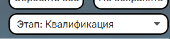</div>

By selecting the qualification stage as shown in the image to get a list of groups (drivers + their karts), you need to:
1) Enter driver info in the drivers window;
2) Enter kart info in the karts window;
3) Enter the number of groups and start generation in the groups window.

## Race stage
<div> 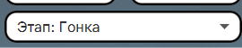</div>

The qualifying results divide the drivers into groups, but it necessary to issue carts, so by selecting the race mode as shown in the image, you can get a list of groups as follows:
1) Enter driver info along with the group number in the drivers window;
2) Enter kart info in the karts window;
3) Start generation in the groups window

## Additional features
The application can also:
- Save data between launches;
- Reset all existing data;
- Reset individual data in the appropriate windows;
- Save information to a .txt file in a special readable format.

# Screenshots of the app

## Qualification stage

### Karts window
<div></div>

### Drivers window
<div>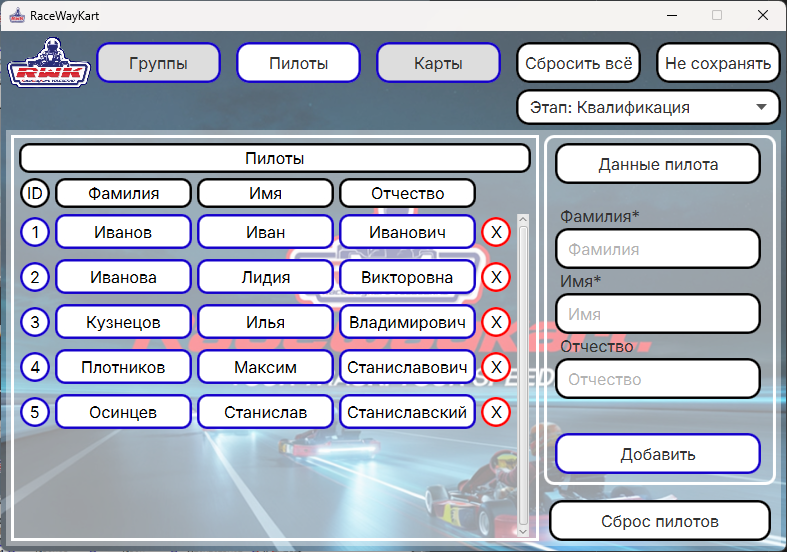</div>


### Groups window
<div>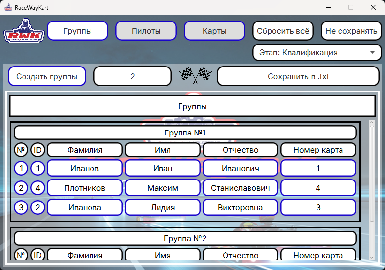</div>

### Txt save
<div>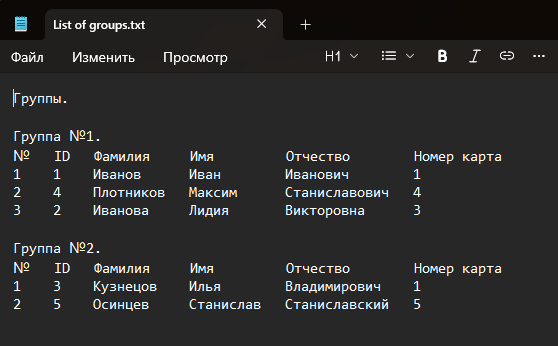</div>

## Race stage

### Karts window
<div>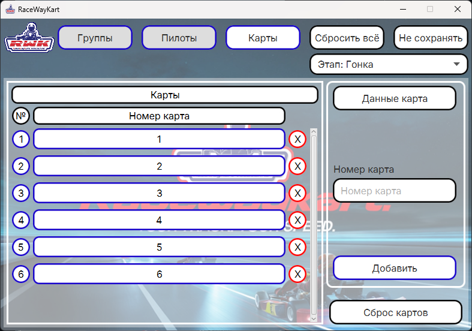</div>

### Drivers window
<div>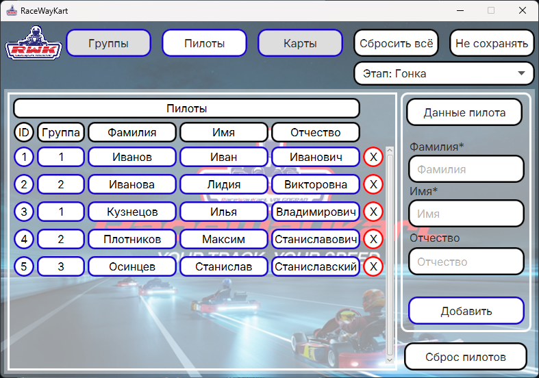</div>


### Groups window
<div>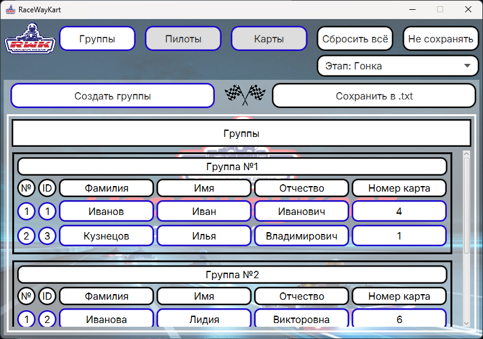</div>

### Txt save
<div>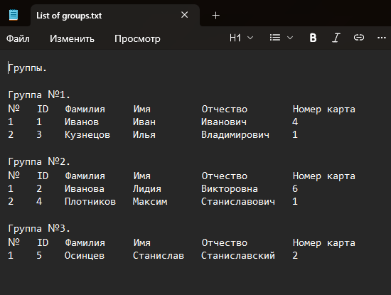</div>